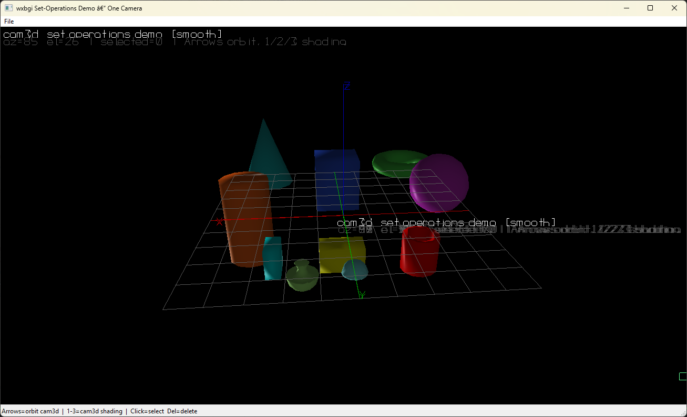
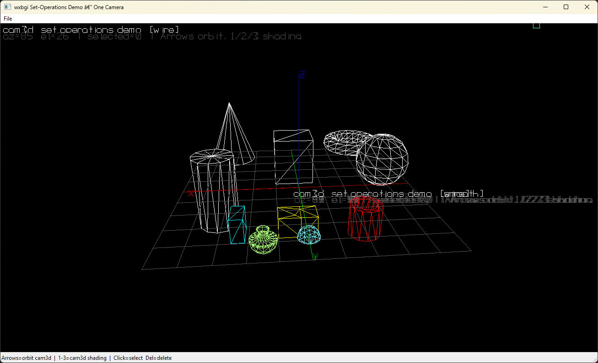

# Object Operations

This page summarizes the retained DDS/CHDOP composition layer built on top of the normal drawing primitives.

Object operations do **not** delete the original primitive objects from the DDS graph. Instead, they create new retained DDS nodes that reference existing object IDs. The composed result is serializable, hideable, labelable, recolorable, and reusable in later compositions.

---

## Overview

The current retained object-operation API in `wx_bgi_dds.h` is:

| Function | Purpose |
|----------|---------|
| `wxbgi_dds_translate(id, dx, dy, dz)` | Create a retained affine-transform node that replays `id` with a translation offset |
| `wxbgi_dds_union(count, ids)` | Create a retained set-union node over existing DDS object IDs |
| `wxbgi_dds_intersection(count, ids)` | Create a retained set-intersection node over existing DDS object IDs |
| `wxbgi_dds_difference(count, ids)` | Create a retained ordered set-difference node over existing DDS object IDs |
| `wxbgi_object_set_face_color(id, color)` | Change the rendered face color of an existing retained solid or set-operation blob |
| `wxbgi_dds_get_child_count(id)` | Return the number of direct referenced child IDs |
| `wxbgi_dds_get_child_at(id, index)` | Return one direct child ID from a retained operation node |

All of these return or operate on normal DDS object IDs, so the results participate in:

- `wxbgi_render_dds(...)`
- `wxbgi_dds_to_json()` / `wxbgi_dds_to_yaml()`
- `wxbgi_dds_set_visible(...)`
- `wxbgi_dds_set_label(...)`
- later composition by other transform or set-operation nodes

> **C/C++ note:** DDS ID getter functions return borrowed `const char *` buffers. Copy them into `std::string` before making later DDS API calls.

---

## Set Operations

Three retained set operations are available:

1. **Union** combines multiple referenced DDS objects into one composed result.
2. **Intersection** keeps only the common overlapping part of the referenced DDS objects.
3. **Difference** subtracts later operands from the first operand in order.

### Current status

- **Translate** is implemented today as the first public affine helper.
- `Transform` nodes already carry a full 4x4 matrix internally; public rotate / scale / general matrix helpers can be added on the same node type later.
- `Union`, `Intersection`, and `Difference` are first-class retained DDS node types with their own draw mode, colour, label, visibility, and serialisation state.
- During retained rendering, operands referenced by transform/set-operation nodes are no longer replayed as standalone roots. The composed node owns the visible result.
- For supported 3D solids the retained set-operation path evaluates closed Manifold volumes and caches the resulting display mesh per DDS scene revision.

### How they are used

The input objects must already exist in the active DDS scene. A set-operation node stores only their IDs; it does not duplicate the leaf geometry.

```cpp
const char *ids[2] = { idA.c_str(), idB.c_str() };
const std::string unionId = wxbgi_dds_union(2, ids);
const std::string isectId = wxbgi_dds_intersection(2, ids);
const std::string diffId  = wxbgi_dds_difference(2, ids);
```

Typical workflow:

1. Draw or create the source objects normally.
2. Capture or look up their DDS IDs and copy them to stable storage in C++.
3. Create a retained union, intersection, or difference node.
4. Optionally label or recolor the composed node.
5. Re-render the scene with `wxbgi_render_dds(...)`.

You no longer need to manually hide operands just to prevent double-drawing during retained replay. DDS render-root traversal handles that ownership automatically.

You can recolor a retained composed blob after it has been created:

```c
wxbgi_object_set_face_color(unionId, YELLOW);
```

### Current behavior

- For supported **3D solid DDS objects** (`Box`, `Sphere`, `Cylinder`, `Cone`, `Torus`, `HeightMap`, `ParamSurface`, `Extrusion`), **Union**, **Intersection**, and **Difference** currently use the exact Manifold-based boolean path during retained rendering.
- **Difference** follows OpenSCAD-style ordered subtraction: operand 0 is the base solid and operands 1..N are subtracted from it in sequence, producing the remaining solid volume.
- For other retained DDS content, the composed result still behaves as a first-class retained DDS object and re-renders through the normal DDS traversal path.

### Volume semantics

Retained 3D set operations are evaluated as **solid volumes** for supported DDS
solid primitives. The rendered triangles are only the display/export form of
that volumetric result, not the boolean model itself.

### Notes

- Set-operation nodes are stored as their own CHDOP/DDS object types:
  - `WXBGI_DDS_SET_UNION`
  - `WXBGI_DDS_SET_INTERSECTION`
  - `WXBGI_DDS_SET_DIFFERENCE`
- Child IDs can point to leaf primitives, transform nodes, or other set-operation nodes.
- Invalid or missing child references are ignored by traversal; exact 3D evaluation requires valid operands and a supported closed-volume conversion path.
- Difference is **ordered**: operand 0 is the base, operands 1..N are subtracted in sequence.

---

## Affine Transformations

The retained transform path is intentionally modeled as an **affine transformation** layer.

The current public helper is:

```cpp
const std::string movedId = wxbgi_dds_translate(id.c_str(), dx, dy, dz);
```

This creates a new retained transform node that references the original object and replays it with the requested offset. The original object remains unchanged.

### Implemented today

- **Translate** is implemented and stored as a retained `Transform` DDS object.

### Why this is an affine path

Internally, the transform node carries a 4x4 matrix so the same retained-node model can later grow into additional affine helpers such as:

- scale
- rotate
- skew
- general matrix (`multmatrix`) transforms

That keeps the API consistent and lets transforms compose naturally with union and intersection nodes.

### High-level implementation design

1. Source primitives are appended to the DDS as normal leaf nodes.
2. `wxbgi_dds_translate(...)` wraps one existing ID in a retained `Transform` node that stores a translation inside its 4x4 matrix.
3. `wxbgi_dds_union(...)`, `wxbgi_dds_intersection(...)`, and `wxbgi_dds_difference(...)` create retained set-operation nodes that store operand IDs only.
4. `wxbgi_render_dds(...)` starts from DDS render roots only. Any operand that is referenced by a transform or set-operation node is replayed through that owner instead of as an independent root.
5. For supported 3D solids the set-operation node renders an exact closed-volume boolean result; for non-exact cases the node still participates in the same retained traversal and masking path.

---

## Minimal Example

```cpp
#include "wx_bgi.h"
#include "wx_bgi_dds.h"
#include "wx_bgi_solid.h"

/* draw two source solids */
wxbgi_solid_box(0.f, 0.f, 0.f, 20.f, 20.f, 20.f);
const std::string boxA = wxbgi_dds_get_id_at(wxbgi_dds_object_count() - 1);

wxbgi_solid_box(10.f, 0.f, 0.f, 20.f, 20.f, 20.f);
const std::string boxB = wxbgi_dds_get_id_at(wxbgi_dds_object_count() - 1);

/* move one of them through a retained transform node */
const std::string movedB = wxbgi_dds_translate(boxB.c_str(), 5.f, 0.f, 0.f);

/* create a retained union node */
const char *ops[2] = { boxA.c_str(), movedB.c_str() };
const std::string blob = wxbgi_dds_union(2, ops);
wxbgi_dds_set_label(blob.c_str(), "translated-box-union");

/* replay through the active camera */
cleardevice();
wxbgi_render_dds(NULL);
```

## Compound-solid screenshots

These screenshots come from the current `wxbgi_set_operations_demo_cpp` scene and show retained translation + set-operation results rendered as compound solids:





---

## Related Pages

- **[DDS.md](./DDS.md)** — retained scene graph, serialization, and CHDOP type list
- **[Camera3D_Map.md](./Camera3D_Map.md)** — camera projection and world/screen mapping
- **[Tests.md](./Tests.md)** — current automated coverage for retained transform and set operations
