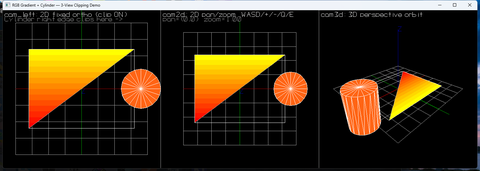
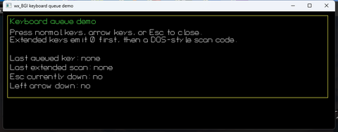
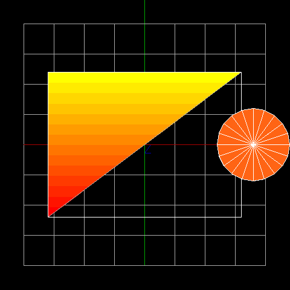
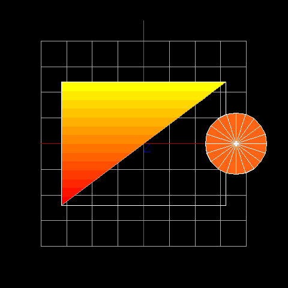
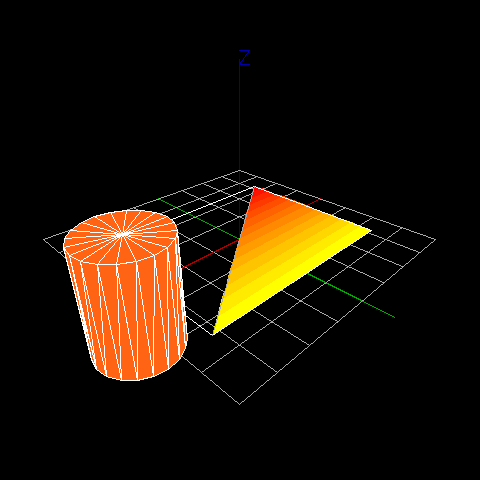
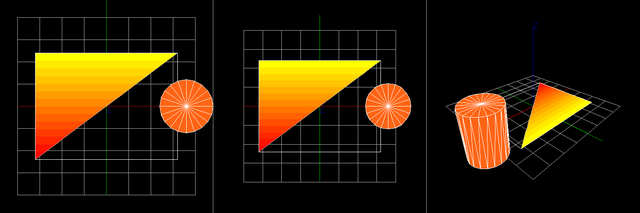

# wx_bgi_graphics -- Screenshots

Screenshots are produced by the built-in `wxbgi_export_png_camera_view()` and
`wxbgi_export_png()` library functions, which read directly from the OpenGL
framebuffer and write a valid PNG file -- no OS screenshot tools needed.

---

## Classic BGI API Coverage (`bgi_api_coverage`)

> `examples/cpp/bgi_api_coverage.cpp`


([full size](images/screenshot_camera_demo.png))

Exercises virtually every classic Borland BGI function: `circle`, `arc`,
`ellipse`, `pieslice`, `sector`, `fillpoly`, `bar3d`, `drawpoly`, `outtextxy`
and more -- all rendered into the 2D pixel buffer, identical output on Windows,
Linux, and macOS.

---

## Keyboard Queue Demo (`wxbgi_keyboard_queue`)

> `examples/cpp/wxbgi_keyboard_queue.cpp`


([full size](images/screenshot_keyboard_queue.png))

Demonstrates the `wxbgi_read_key()` / `wxbgi_is_key_down()` extension API
that emulates the classic DOS BGI keyboard queue, including special-key
two-byte sequences.

---

## Camera Demo -- Fixed 2D Top-Down View (`cam_left`)

> `examples/cpp/wxbgi_camera_demo.cpp` -- left panel


([full size](images/screenshot_cam_left_2d.png))

The `cam_left` camera is a fixed 2D orthographic view looking straight down the
Z-axis at the XY plane.  The gradient-filled rectangle and cylinder are drawn
in world coordinates and projected through this camera.  Viewport clipping
is active: objects that cross the panel boundary are partially clipped.

---

## Camera Demo -- Interactive 2D Pan / Zoom (`cam2d`)

> `examples/cpp/wxbgi_camera_demo.cpp` -- middle panel


([full size](images/screenshot_cam2d_interactive.png))

An interactive 2D camera viewport supporting pan (WASD keys), zoom (+/- keys),
and rotation (Q/E keys) at runtime.  The scene is stored in the DDS and
re-projected through `cam2d` on every frame -- panning and zooming do not
alter the DDS data, only the camera transform.

---

## Camera Demo -- 3D Perspective Orbit (`cam3d`)

> `examples/cpp/wxbgi_camera_demo.cpp` -- right panel


([full size](images/screenshot_cam3d_persp.png))

A full perspective camera (fovY = 60 deg) orbiting the scene using arrow keys
to change azimuth and elevation.  The same DDS scene that drives the two 2D
views is re-projected through this camera, demonstrating that the DDS is a
single source of truth for all views simultaneously.

---

## Camera Demo -- Three-Panel Composite

> Full 1440 x 480 window


([full size](images/screenshot_camera_demo_3panel.png))

All three camera viewports side-by-side in a single window: fixed 2D ortho
(left), interactive 2D (centre), and 3D perspective (right).  Viewport
dividers and panel labels are drawn in pixel space on top of the DDS renders.

---

## OpenLB-Style Live Demo

> `examples/cpp/wxbgi_openlb_live_demo.cpp`


Demonstrates the new non-blocking solver-view pattern for OpenLB-style usage:
the simulation loop stays in control, `wxbgi_field_draw_scalar_grid()` renders
the false-colour scalar field, `wxbgi_field_draw_vector_grid()` adds decimated
vector arrows, and `wxbgi_field_draw_scalar_legend()` draws the live legend.

---

## Generating Screenshots Yourself

After building the project:

```
# Windows
build\Debug\capture_screenshots.exe images

# Linux / macOS
build/capture_screenshots images
```

The utility renders each camera view through `wxbgi_render_dds()`, then calls
`wxbgi_export_png_camera_view()` (and `wxbgi_export_png()` for the composite)
to write PNG files directly into the `images/` folder.
