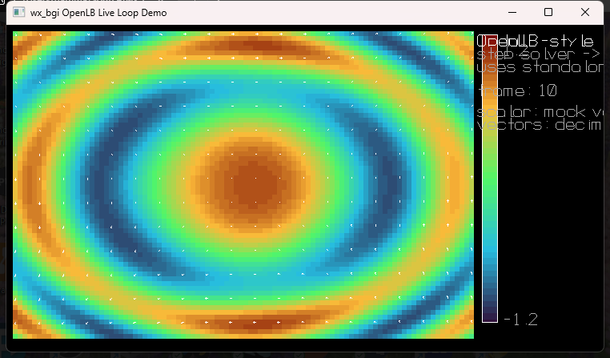

# OpenLB Support

`wx_bgi_graphics` does **not** turn OpenLB into a built-in GUI toolkit. Instead,
it provides a practical way to use `wx_bgi` as the **interactive viewer shell**
around an OpenLB simulation.

OpenLB remains the simulation owner:

1. OpenLB advances the solver.
2. Your code extracts scalar/vector snapshots from the current state.
3. `wx_bgi` renders those snapshots live in a wx-backed window.

---

## What is OpenLB?

[OpenLB](https://www.openlb.net/) is an open-source C++ framework for
Lattice Boltzmann Method (LBM) simulation. It is aimed at Computational Fluid Dynamics (CFD) and related
transport problems, involving multiple physics(physical) systems, with strong emphasis on:

- batch / HPC workflows
- MPI / OpenMP / GPU-capable simulation backends
- offline output such as VTK, images, CSV, and plots

OpenLB itself is primarily a **simulation framework**, not a live interactive
windowing system. That is where `wx_bgi_graphics` fits in.

---

## What support is provided here?

The shared library now includes an **optional OpenLB-oriented live-view path**
with these parts:

### 1. Generic field-visualization helpers

Declared in `src/wx_bgi_ext.h`:

- `wxbgi_field_draw_scalar_grid(...)`
- `wxbgi_field_draw_vector_grid(...)`
- `wxbgi_field_draw_scalar_legend(...)`

These are generic solver-view helpers, not OpenLB-only APIs. They are intended
for live rendering of:

- velocity magnitude
- pressure / density
- vector arrows
- legends and HUD overlays

### 2. Header-only live-loop wrappers

Declared in `src/wx_bgi_openlb.h`:

- `wxbgi_openlb_begin_session(...)`
- `wxbgi_openlb_pump()`
- `wxbgi_openlb_present()`

These wrappers support an **OpenLB-style non-blocking main loop** where the
simulation remains in charge and `wx_bgi` only handles rendering and event
pumping.

### 3. Interactive demo

The repository now includes:

- `examples/cpp/wxbgi_openlb_live_demo.cpp`

This demo uses a mock live field, but it demonstrates the intended integration
pattern for a real OpenLB solver:

```cpp
while (wxbgi_openlb_pump()) {
    stepSolverChunk();

    cleardevice();
    wxbgi_field_draw_scalar_grid(...);
    wxbgi_field_draw_vector_grid(...);
    wxbgi_field_draw_scalar_legend(...);

    wxbgi_openlb_present();
}
```

### 4. Optional build and staging support

OpenLB support is **opt-in**:

```text
WXBGI_ENABLE_OPENLB=ON
OPENLB_ROOT=<path to local OpenLB release tree>
```

When enabled, the build adds:

- OpenLB option validation (`OPENLB_ROOT\src\olb.h` must exist)
- `openlb_bridge_package` target

That staging target collects the current shared library, headers, and demo into
`build/openlb_bridge` so they can be referenced from an OpenLB checkout or demo
workflow.

---

## What is not provided?

The current support intentionally does **not** do the following:

- bundle OpenLB into the main shared library as a hard dependency
- expose OpenLB template internals through the stable DLL ABI
- replace OpenLB's own solver setup, meshing, or physics code
- provide direct built-in 3D iso-surface extraction from OpenLB fields

In other words: this repo currently provides the **viewer/runtime bridge**, not
a full OpenLB binding layer.

---

## Recommended integration model

Use `wx_bgi` as the interactive visualization frontend:

1. create a standalone wx-backed session
2. advance OpenLB in your own control loop
3. publish reduced scalar/vector data for display
4. draw using the `wxbgi_field_*` helpers
5. keep the GUI responsive with `wxbgi_openlb_pump()` / `wxbgi_openlb_present()`

This matches the current wx rendering model well:

- rendering stays on the GUI side
- the simulation loop stays under user control
- no blocking `wxIMPLEMENT_APP`-managed application loop is required

---

## Demo screenshot

> `examples/cpp/wxbgi_openlb_live_demo.cpp`



The demo shows the current viewer pattern: a live false-colour scalar field,
decimated vector arrows, and a scalar legend rendered in real time inside the
wx-backed `wx_bgi` window.
