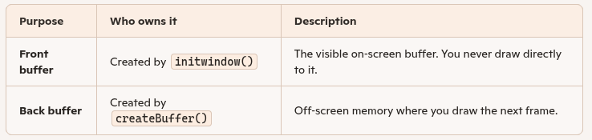

## BGI Double Buffering Tutorial

This tutorial explains how double (and layered) buffering works in `wx_bgi_graphics` and
how to write smooth, flicker-free animation using the real API.

> **Note on older references:** An earlier draft of this document used function names such as
> `setVisualBuffer()`, `setActiveBuffer()`, `createBuffer()`, and `destroyBuffer()`.
> **None of these functions exist in the library.**  The correct API is described below.

---

### 1. How Buffering Works in wx_bgi_graphics

The library implements **two independent layers** of buffering:

#### Layer 1 -- BGI Software Page Buffers

`initwindow()` / `initgraph()` automatically allocates **exactly two** software pixel
buffers in CPU memory: **page 0** and **page 1**.  Each buffer stores one colour-index
byte per pixel (the BGI palette index or an extended RGB slot).

| Variable | Meaning |
|---|---|
| `activePage` | The page all BGI drawing commands write to (0 or 1). |
| `visualPage` | The page that is read and sent to OpenGL when a frame is presented (0 or 1). |

You control these with three BGI API calls:

| Function | Effect |
|---|---|
| `setactivepage(int page)` | Redirect all drawing to page 0 or page 1. |
| `setvisualpage(int page)` | Make page 0 or page 1 the displayed page, and immediately present it to the screen. |
| `swapbuffers()` | Atomically exchange `activePage` and `visualPage`, then present -- the canonical double-buffer flip. |

#### Layer 2 -- OpenGL / GLFW Hardware Double Buffer

GLFW opens the window with a hardware double-buffered OpenGL context (a standard
front and back OpenGL render buffer managed by the GPU driver).

Every time a BGI page is to be shown, the internal `flushToScreen()` function:

1. Clears the OpenGL back buffer.
2. Iterates every pixel in the **visual** BGI page buffer.
3. Converts each colour index to RGB and emits an OpenGL `glVertex2i` point.
4. Calls `glFlush()` then `glfwSwapBuffers()` -- this atomically swaps the GPU
   front/back buffers, displaying the new frame.

The programmer never calls `glfwSwapBuffers()` directly; `flushToScreen()` is an
internal function invoked by `setvisualpage()`, `swapbuffers()`, and
`wxbgi_swap_window_buffers()`.

#### Layer 3 (advanced) -- Manual OpenGL Frame Control

For programmers mixing raw OpenGL with BGI, the extension API exposes:

| Function | Effect |
|---|---|
| `wxbgi_poll_events()` | Process OS/window events without swapping buffers. |
| `wxbgi_swap_window_buffers()` | Call `glfwSwapBuffers()` directly (skips BGI pixel upload). |
| `wxbgi_begin_advanced_frame()` | Begin a manual OpenGL draw frame. |
| `wxbgi_end_advanced_frame(int swap)` | End a frame; optionally swap the OpenGL buffers. |

---

### 2. Conceptual Steps (English Explanation)

##### Step 1 -- Initialize Graphics

Call `initwindow()` or `initgraph()`.  Two BGI software page buffers (page 0 and
page 1) are created automatically.  The GLFW window opens with a hardware
double-buffered OpenGL context.

##### Step 2 -- Direct Drawing to the Back Buffer

Call `setactivepage(1)` to send all drawing commands to page 1 while page 0
remains visible.  In Double-Buffering you deliberately avoid drawing on the
visible page.

##### Step 3 -- Draw Your Frame

Use normal BGI drawing commands (`line`, `circle`, `outtextxy`, etc.).
Nothing appears on screen yet -- all output goes into the page 1 CPU buffer.

##### Step 4 -- Flip / Present the Frame

Call `swapbuffers()`.  This exchanges which page is active and which is visual,
then calls `flushToScreen()` to upload the new visual page to OpenGL and
call `glfwSwapBuffers()` on the GPU.

##### Step 5 -- Clear and Repeat

Call `cleardevice()` (which clears the new active page) and draw the next frame.

##### Step 6 -- Cleanup

Call `closegraph()`.  Both software page buffers are freed and the GLFW window is
destroyed.

  

  
---

### 3. Pseudo-Code (Generic Explanation)

```
initialize_graphics()          // allocates page 0 and page 1

set_active_page(1)             // draw to the back buffer

while running:
    clear_device()             // clear the active (back) page

    draw_scene()               // all drawing goes into the back page

    swap_buffers()             // atomic flip: back -> visual, then flush to GPU
end while

shutdown_graphics()            // free buffers, close window
```
  


---

### 4. Real API Example in C++

```cpp
#include "wx_bgi.h"
#include "wx_bgi_ext.h"

int main()
{
    initwindow(800, 600, "Double Buffer Demo");

    // Direct all drawing to page 1 (the hidden back buffer).
    setactivepage(1);
    // Keep page 0 visible while we draw.
    setvisualpage(0);

    while (!wxbgi_should_close())
    {
        wxbgi_poll_events();          // process keyboard / mouse / close events

        cleardevice();                // clear the active (back) page

        // --- draw the frame ---
        setcolor(WHITE);
        line(10, 10, 400, 300);
        outtextxy(20, 320, "Frame rendered off-screen");
        // ----------------------

        swapbuffers();                // flip: page 1 -> visual, page 0 -> active
                                      // internally calls flushToScreen() and
                                      // glfwSwapBuffers() to present to screen
    }

    closegraph();
    return 0;
}
```

#### Alternative: use swapbuffers() without explicit page management

```cpp
initwindow(800, 600, "Swap Demo");

while (!wxbgi_should_close())
{
    wxbgi_poll_events();

    cleardevice();
    // draw...
    circle(400, 300, 100);

    swapbuffers();   // atomically flips active/visual pages and presents
}

closegraph();
```

---

### 5. Two Pages Only -- No Arbitrary Buffer Count

The library provides **exactly two** BGI software page buffers (page 0 and page 1).
It does **not** support creating additional buffers with a `createBuffer()` call --
that function does not exist.

Classic triple-buffering at the BGI level is therefore not available.  However,
the underlying GLFW/OpenGL context is always hardware double-buffered, so the
complete system pipeline is:

```
BGI page 0 (CPU)  \
                    --> flushToScreen() --> OpenGL back buffer --> OpenGL front buffer --> Display
BGI page 1 (CPU)  /                        (GPU)                   (GPU, shown)
```

The GPU front/back buffer swap (`glfwSwapBuffers`) is triggered automatically
inside `flushToScreen()` every time `setvisualpage()` or `swapbuffers()` is called.
This gives tear-free presentation without any additional programmer effort.

---

### 6. Multi-Threaded Rendering Considerations

The library protects all BGI state with a single internal mutex (`gMutex`).  Every
public API function acquires this mutex before reading or writing state, so
concurrent calls from multiple threads will not corrupt internal state.

However, there are still design-level considerations:

- `flushToScreen()` (called by `swapbuffers()`) must run on the thread that owns the
  OpenGL context.  By default this is the thread that called `initwindow()`.
- If you draw from a background thread using `setactivepage(1)` and present from the
  main thread using `swapbuffers()`, the mutex serialises the two, but you must ensure
  the background thread has finished its frame before calling `swapbuffers()`.

**Safe single-producer / single-display pattern:**

```
Main thread (display loop):
    wxbgi_poll_events()
    swapbuffers()              // presents the last completed back buffer

Worker thread (renderer):
    setactivepage(1)
    cleardevice()
    draw_scene()
    // signal main thread that frame is ready
```

Use a `std::atomic<bool>` or `std::condition_variable` to coordinate; do not call
`swapbuffers()` from both threads simultaneously.

---

### 7. Summary of Actual API Functions

| BGI Classic API | Effect |
|---|---|
| `initwindow(w, h, title)` | Open window; allocate page 0 and page 1. |
| `setactivepage(page)` | Direct drawing to page 0 or page 1 (0 = default). |
| `setvisualpage(page)` | Display page 0 or page 1; triggers `flushToScreen()`. |
| `swapbuffers()` | Atomic flip of active/visual pages + `flushToScreen()`. |
| `cleardevice()` | Clear the active page to the background colour. |
| `closegraph()` | Free page buffers, destroy GLFW window. |

| Extension API (`wxbgi_*`) | Effect |
|---|---|
| `wxbgi_poll_events()` | Process OS events (no buffer swap). |
| `wxbgi_swap_window_buffers()` | Swap the OpenGL front/back buffers directly. |
| `wxbgi_begin_advanced_frame()` | Begin a manual OpenGL frame (clears GL buffers). |
| `wxbgi_end_advanced_frame(swap)` | End a frame; swap GL buffers if `swap != 0`. |
| `wxbgi_should_close()` | Returns non-zero when the user closes the window. |

The canonical animation loop is:

```cpp
setactivepage(1);
setvisualpage(0);

while (!wxbgi_should_close())
{
    wxbgi_poll_events();
    cleardevice();
    draw();
    swapbuffers();
}
closegraph();
```
